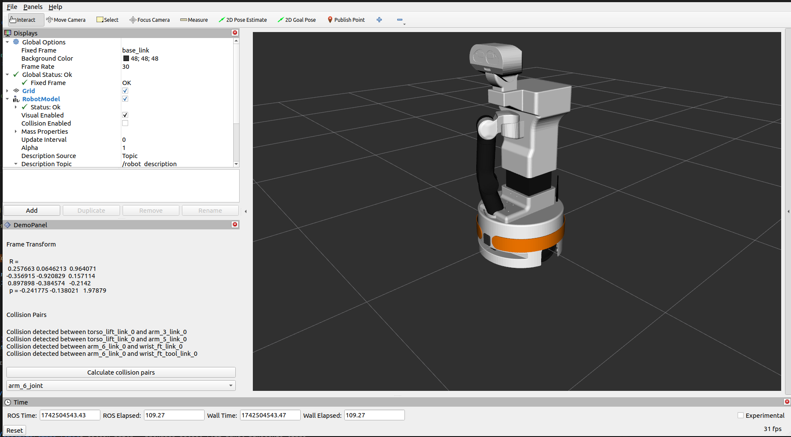

# rviz panel for pinocchio library
**-> New version:** https://github.com/enrico391/Rviz-pinocchio-panel

Modified version of tutorial https://docs.ros.org/en/humble/Tutorials/Intermediate/RViz/RViz-Custom-Panel/RViz-Custom-Panel.html

Simple plugin for interact with pinocchio library through rviz

I made this for use-case and GSoC2025 selection


## Demo Video

Watch the demo video to see the RViz panel in action: (click for video)

[](https://youtu.be/mmP-8mRg5ss)


## Usage
- Clone the repo inside your robot workspace
- Build the package: ``` colcon build --packages-select rviz_panel_pinocchio_tiago ```
- Start rviz
- Add panel to rviz
